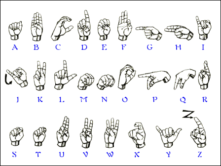
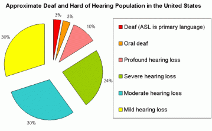
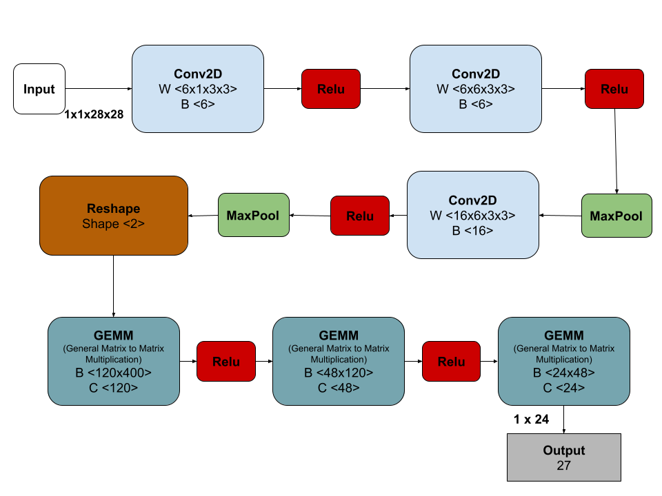

<!-- PROJECT SHIELDS -->

[![LinkedIn][linkedin-shield]][linkedin-url]

<!-- PROJECT LOGO -->
 
<h1 align="center">Live Sign Language Translator</h1>

  
  

    Training a convolutional neural network with PyTorch and a live implementation of detecting which sign language is being shown with openCV 
    
  

<!-- TABLE OF CONTENTS -->

  
Table of Contents

  <ol>
    <li>
      <a href="#about-the-project">About The Project</a>
      <ul>
        <li><a href="#built-with">Built With</a></li>
      </ul>
    </li>
    <li>
      <a href="#dataset">Dataset</a>
    </li>
    <li>
      <a href="#convolutional-neural-network">Convolutional Neural Network</a>
      <ul>
        <li><a href="#network-architecture">Network Architecture</a></li>
      </ul>
      <ul>
        <li><a href="#parameters">Parameters</a></li>
      </ul>
    <li>
      <a href="#results">Results</a>
    </li>
    <li><a href="#summary">Summary</a></li>
    <li><a href="#contact">Contact</a></li>
  </ol>

<!-- ABOUT THE PROJECT -->
## About The Project

American Sign Language(ASL) is an option of comunication for those who are deaf and hard of hearing. It is used by 500,000~ people in the US and Canada. The [National Center for Health Statistics(NCHS)](https://www.cdc.gov/nchs/index.htm) estimates that about 28 million Americans(10%~) have some degree of hearing loss with about 2 million of those being classified as deaf.  Since this is the one of the few medium where deaf people will be able to communicate their feelings and emotion, it is important for people to be able to understand ASL. There are no exact census of how many people use/know ASL, but the rough estimate from the internet tells us that it is somewhere between 150,000 and 500,000 people. That is miniscule compared to the fact that there are around 48 million people in the US. 

  

This is why it is important and crucial that we have need something that could break that barrier of communication. With the help of Machine Learning, we can create a model that could classify the alphabets of ASL correctly using labeled pictures and we can implement the model into a live app that could translate one's hand gesture into the English alphabet. 

### Built With

* [Python 3.8.8](https://www.python.org/)
* [PyTorch 1.8.1](https://pytorch.org/)
* [OpenCV 4.0.1](https://opencv.org/)
* [ONNX 1.9.0](https://onnx.ai/)

## Dataset 
This dataset was taken from [Kaggle](https://www.kaggle.com/datamunge/sign-language-mnist?select=sign_mnist_test). It contains a train folder and a test folder. Both these folder are patterend closely with the classic MNIST with a label between 0~25 with no cases for "J"(9) and "Z"(25) because they are gesture based. The train set has 27,445 cases and the test set has 7,172 cases. The CSV file contains 785 columns with the first being the label and the 784 being pixels(28x28). Both the datasets are balanced with very similar occurences of each letters. 

| Label  | Training Set | Test Set |
|--------|--------------|----------|
| A (0)  | 1,126        | 331      |
| B (1)  | 1,010        | 432      |
| C (2)  | 1,144        | 310      |
| D (3)  | 1,196        | 245      |
| E (4)  | 957          | 498      |
| F (5)  | 1,204        | 247      |
| G (6)  | 1,090        | 348      |
| H (7)  | 1,013        | 436      |
| I (8)  | 1,162        | 288      |
| J (9)  | n/a          | n/a      |
| K (10) | 1,114        | 331      |
| L (11) | 1,241        | 209      |
| M (12) | 1,055        | 394      |
| N (13) | 1,151        | 291      |
| O (14) | 1,196        | 246      |
| P (15) | 1,088        | 347      |
| Q (16) | 1,279        | 164      |
| R (17) | 1,294        | 144      |
| S (18) | 1,199        | 246      |
| T (19) | 1,186        | 248      |
| U (20) | 1,161        | 266      |
| V (21) | 1,082        | 346      |
| W (22) | 1,225        | 206      |
| X (23) | 1,164        | 267      |
| Y (24) | 1,118        | 332      |
| Z (25) | n/a          | n/a      |

## Convolutional Neural Network
For this project, I used PyTorch to create a neural network. This [tutorial](https://pytorch.org/tutorials/beginner/basics/buildmodel_tutorial.html) will help you if you're looking to build a model using PyTorch. 

The first step was to apply *data augmentation* which waas done by using RandomResizedCrop to zoom into the pictures, then I normalized them to make them between (0,1). This was done in the *preprocessing* file and it outputted tensors, which is needed when you are using neural networks. 

  

### Network Architecture
The outline of the network is as followed. 

  

### Parameters 
The main order for this neural network is: Forward -> Backward -> Optimize 

After trying many different optimizers and loss functions, the best results were given and this is what it was: 
* Loss Function: Cross Entropy Loss 
* Optimizer: Stochastic Gradient Descent 
  * Learning Rate = 0.01
  * Momentum = 0.9 
* Scheduler: StepLR
  * Step Size = 10 
  * Gamma = 0.1 
* Epochs: 12

## Results 
When I trained the model, the first epoch has a loss of 6.318 and by the final epoch, the loss went down all the way to 
0.00000018 which is great! 

After this, we evaluate the model on the test set which gave me the following results:
* Training Accuracy: 99.8% 
* Validation Accuracy 96.9% 

Since we gained great results, I converted the model to ONNX to use with OpenCV to make this into a live-detection with a camera. 

## Contact 

Justin (Jin Wook) Lee  - justinjwlee1114@gmail.com

[linkedin-shield]: https://img.shields.io/badge/-LinkedIn-black.svg?style=for-the-badge&logo=linkedin&color=blue
[linkedin-url]: https://www.linkedin.com/in/justinjwlee1114/

