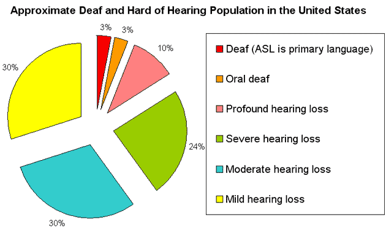

<!-- PROJECT SHIELDS -->

[![LinkedIn][linkedin-shield]][linkedin-url]

<!-- PROJECT LOGO -->
 
<h1 align="center">Live Sign Language Translator</h1>

  
  

    Training a convolutional neural network with PyTorch and a live implementation of detecting which sign language is being shown with openCV 
    
  

<!-- TABLE OF CONTENTS -->

  
Table of Contents

  <ol>
    <li>
      <a href="#about-the-project">About The Project</a>
      <ul>
        <li><a href="#built-with">Built With</a></li>
      </ul>
    </li>
    <li>
      <a href="#dataset">Dataset</a>
    </li>
    <li>
      <a href="#convolutional-neural-network">Convolutional Neural Network</a>
      <ul>
        <li><a href="#image-processing">Image Processing</a></li>
      </ul>
      <ul>
        <li><a href="#data-augmentation">Data Augmentation</a></li>
      </ul>
      <ul>
        <li><a href="#network-architecture">Network Architecture</a></li>
      </ul>
    <li>
      <a href="#results">Results</a>
      <ul>
        <li><a href="#cnn-results">CNN Results</a></li>
      </ul>
    </li>
    <li><a href="#summary">Summary</a></li>
    <li><a href="#contact">Contact</a></li>
  </ol>

<!-- ABOUT THE PROJECT -->
## About The Project

American Sign Language(ASL) is an option of comunication for those who are deaf and hard of hearing. It is used by 500,000~ people in the US and Canada. The [National Center for Health Statistics(NCHS)](https://www.cdc.gov/nchs/index.htm) estimates that about 28 million Americans(10%~) have some degree of hearing loss with about 2 million of those being classified as deaf.  Since this is the one of the few medium where deaf people will be able to communicate their feelings and emotion, it is important for people to be able to understand ASL. There are no exact census of how many people use/know ASL, but the rough estimate from the internet tells us that it is somewhere between 150,000 and 500,000 people. That is miniscule compared to the fact that there are around 48 million people in the US. 

  

This is why it is important and crucial that we have need something that could break that barrier of communication. With the help of Machine Learning, we can create a model that could classify the alphabets of ASL correctly using labeled pictures and we can implement the model into a live app that could translate one's hand gesture into the English alphabet. 

### Built With

* [Python 3.8.8](https://www.python.org/)
* [PyTorch 1.8.1](https://pytorch.org/)
* [OpenCV 4.0.1](https://opencv.org/)
* [ONNX 1.9.0](https://onnx.ai/)

## Contact 

Justin (Jin Wook) Lee  - justinjwlee1114@gmail.com

[linkedin-shield]: https://img.shields.io/badge/-LinkedIn-black.svg?style=for-the-badge&logo=linkedin&color=blue
[linkedin-url]: https://www.linkedin.com/in/justinjwlee1114/

